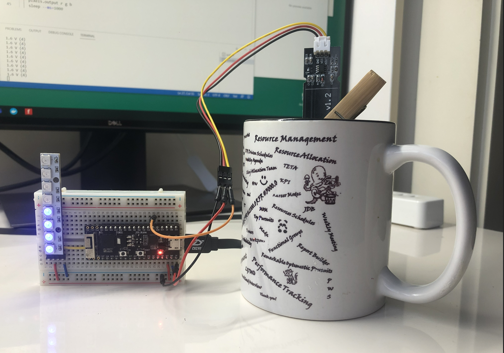

# Show Measurements from Capacitive Moisture Sensor on RGB LED Strip

This is a simple application to read measurements from capacitive moisture sensor and display read values on RGB LED strip.

This application is using toit pixel strip library that can be addedd to this repository by running:

```bash
toit pkg install github.com/toitware/toit-pixel-strip
```



