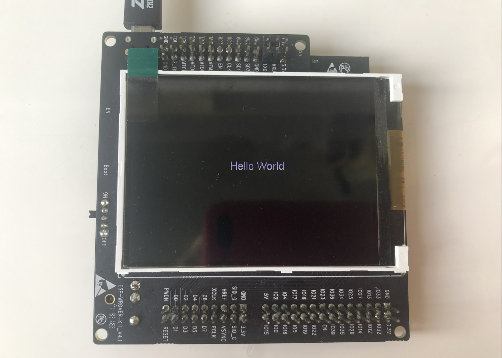

# Show Climate Measurements with ESP-WROVER-KIT

This repository contains a simple Toit application that shows temperature, relative humidity and barometric pressure on TFT display of ESP-WROVER-KIT. The following description provides a step by step instruction how to develop the application. We will start from testing hardware and software that provides individual functionality, e.g. reading of barometric pressure sensor or showing some text on the display. Then we will put the individual pieces together to have the complete application.


## Table of Contents

- [Required Hardware](#required-hardware)
- [Hardware Connections](#hardware-connections)
  - [BME280 Pressure Sensor](#bme280-pressure-sensor)
  - [PIR Sensor](#pir-sensor)
- [Installation of Libraries](#installation-of-libraries)
- [How to Use Toit](#how-to-use-toit)
- [Compatibility](#compatibility)
  - [Toit](#toit)
  - [Jaguar](#jaguar)
  - [Libraries](#libraries)
- [Step by Step Guide](#step-by-step-guide)
  - [Set up Project](#set-up-project)
  - [Flash Jaguar](#flash-jaguar)
  - [Monitor Jaguar](#monitor-jaguar)
  - [Test PIR Sensor](#test-pir-sensor)
  - [Test BME280 Sensor](#test-bme280-sensor)
  - [Test Display](#test-display)
  - [All Pieces Together](#all-pieces-together)
- [Conclusion](#conclusion)


## Required Hardware

To run the application the following hardware is required.

- [ESP-WROVER-KIT](https://docs.espressif.com/projects/esp-idf/en/latest/esp32/hw-reference/esp32/get-started-wrover-kit.html)
- [BME280 pressure sensor](https://www.bosch-sensortec.com/products/environmental-sensors/pressure-sensors/bme280/) on a breakboard
- PIR motion sensor
- Some wires to make connections
- Optionally a protoboard and sockets to provide more permanent connection between ESP-WROVER-KIT as well as BME280 and PIR.


## Hardware Connections

The example code is configured for the connections described below.

### BME280 Pressure Sensor

| ESP32 GPIO  | BME280 Pin | Description of BME280 Pin Functionality  |
|-------------|------------|------------------------------------------|
| 3.3V        | VCC        | Power Supply                             |
| GND         | GND        | Ground                                   |
| GPIO13      | SCL        | I2C Clock                                |
| GPIO14      | SDA        | I2C Data                                 |

### PIR Sensor

| ESP32 GPIO  | PIR Pin    | Description of PIR Pin Functionality  |
|-------------|------------|---------------------------------------|
| 3.3V        | +          | Power Supply                          |
| GND         | -          | Ground                                |
| GPIO34      | OUT        | Motion Detected                       |


## Installation of Libraries

There are couple of libraries required to compile and run this application. The libraries are not directly included in this repository. Instead, the name, url, version and hash of each library is saved in [package.yaml](package.yaml) and [package.lock](package.lock) files. If you already have a copy of this repository and would like to install the libraries, then open a terminal, go the `climate-tft` folder and run the following command:

```
toit pkg update
```

This command will upload the libraries basing on information contained in `package` files.

If you like to install the libraries in a new project folder that does not contain any `package` information, run the following commands:

```
toit pkg install github.com/toitware/bme280-driver
toit pkg install github.com/toitware/toit-color-tft
toit pkg install github.com/toitware/toit-pixel-display
toit pkg install github.com/toitware/toit-icons-pictogrammers
```

## How to Use Toit

Check the readme file in the [root folder](../README.md) for information on how to configure and use Toit.

## Compatibility

This application has been run using the following software:

### Toit

```
PS C:\Users\krzys\toit\climate-tft> toit version
+---------+------------+
| VERSION |    DATE    |
+---------+------------+
| v1.19.7 | 2022-03-07 |
```

### Jaguar

```
PS C:\Users\krzys\toit\climate-tft> jag version
Version:         v1.3.1
SDK version:     v2.0.0-alpha.12
Build date:      2022-07-01T15:49:05Z
```

### Libraries

See [package.yaml](package.yaml)


## Step by Step Guide

The following guide presents the process to test individual components of the application and then running the complete application. 

If not done already, please install Toit and check if it works following  [Quick start guide](https://docs.toit.io/getstarted).

Then install Jaguar and check if it works following [instructions](https://github.com/toitlang/jaguar) on GitHub. This guide is using Jaguar for the application development. The reason is that _climate-tft_ application does not need to use cloud infrastructure of Toit and local development directly on your PC is faster.


### Set up Project

Start of by creating a new empty folder e.g., `climate-tft` and then opening this folder in VS Code. 

In the folder we are going to create some test files and check if they work with the hardware. 

You can create a new file by right clicking in VS Code EXPLORER pane on the left, selecting 'New File' from the context menu and entering the file name. Then you can just copy and paste to this file the code taken from https://github.com/krzychb/toit-samples/tree/main/climate-tft.


### Flash Jaguar

Before loading any test code you need to flash Jaguar application to your ESP-WROVER-KIT. Open a terminal window by clicking `Terminal` > `New Terminal` from the VS Code menu. In the terminal window enter:

```
jag flash --wifi-ssid [ssid-of-your-wifi] --wifi-password [password-to-your-wifi] --name climate-tft-name
```

Replace `[ssid-of-your-wifi]` and `[password-to-your-wifi]` with SSID and password to access point of your wifi. Instead of `climate-tft-name` put a specific name of your choice. You can skip `--name climate-tft-name` if there no other Toit devices running on your network. 

You will be asked to select a port name to your board. ESP-WROVER-KIT will be visible under two ports. Select the port with the higher number. The log of successful flashing will look similar to below:

```
PS C:\Users\krzys\toit\climate-tft> jag flash --wifi-ssid my-ssid --wifi-password my-password  --name climate-tft-krzysztof
v COM8
Flashing device over serial on port 'COM8' ...
esptool.py v3.0
Serial port COM8
Connecting....
Chip is ESP32-D0WD (revision 1)
Features: WiFi, BT, Dual Core, 240MHz, VRef calibration in efuse, Coding Scheme None
Crystal is 40MHz
MAC: ac:67:b2:71:61:18
Uploading stub...
Running stub...
Stub running...
Changing baud rate to 921600
Changed.
Configuring flash size...
Auto-detected Flash size: 4MB
Compressed 15840 bytes to 11108...
Wrote 15840 bytes (11108 compressed) at 0x00001000 in 0.1 seconds (effective 1002.8 kbit/s)...
Hash of data verified.
Compressed 3072 bytes to 147...
Wrote 3072 bytes (147 compressed) at 0x00008000 in 0.0 seconds (effective 1535.6 kbit/s)...
Hash of data verified.
Compressed 8192 bytes to 31...
Wrote 8192 bytes (31 compressed) at 0x0000d000 in 0.0 seconds (effective 4523.9 kbit/s)...
Hash of data verified.
Compressed 1205216 bytes to 782390...
Wrote 1205216 bytes (782390 compressed) at 0x00010000 in 12.7 seconds (effective 757.6 kbit/s)...
Hash of data verified.

Leaving...
Hard resetting via RTS pin...
PS C:\Users\krzys\toit\climate-tft>
```

You can proceed to the next step only after successfully flashing Jaguar application.


### Monitor Jaguar

It is a good idea to have an access to log reported by Jaguar. In previously opened terminal window run:

```
jag monitor --port [port-to-monitor]
```

Instead of `[port-to-monitor]` enter the port name used previously to flash Jaguar. Log of successfully executed command will look like follows:

```
PS C:\Users\krzys\toit\climate-tft> jag monitor --port COM8
Starting serial monitor of port 'COM8' ...
ets Jun  8 2016 00:22:57

rst:0x1 (POWERON_RESET),boot:0x1e (SPI_FAST_FLASH_BOOT)
configsip: 0, SPIWP:0xee
clk_drv:0x00,q_drv:0x00,d_drv:0x00,cs0_drv:0x00,hd_drv:0x00,wp_drv:0x00
mode:DIO, clock div:2
load:0x3fff0030,len:188
ho 0 tail 12 room 4
load:0x40078000,len:12672
load:0x40080400,len:2892
entry 0x400805c0
[toit] Starting <v2.0.0-alpha.8>
[toit] clearing RTC memory: invalid checksum
[wifi] DEBUG: connecting
[wifi] DEBUG: connected
[wifi] INFO: dhcp assigned address {ip: 192.168.1.36}
[jaguar] INFO: running Jaguar device 'climate-tft-krzysztof' (id: '6f40f4bd-50c2-4994-9faf-90085c86f842') on 'http://192.168.1.36:9000'
```
Now you are ready to start testing the application code.


### Test PIR Sensor

In this step we are going to check if PIR sensor is operational. If motion is detected then backlight of TFT screen of ESP-WROVER-KIT will turn on for one second. If there is no motion the screen will be off.

Connect PIR sensor to [Main I/O Connector / JP1](https://docs.espressif.com/projects/esp-idf/en/latest/esp32/hw-reference/esp32/get-started-wrover-kit.html#main-i-o-connector-jp1) of ESP-WROVER-KIT:

| ESP32 GPIO  | PIR Pin    | Description of PIR Pin Functionality  | Wire Color  |
|-------------|------------|---------------------------------------|--------------
| 3.3V        | +          | Power Supply                          | Red         |
| GND         | -          | Ground                                | Black       |
| GPIO34      | OUT        | Motion Detected                       | White       |

Backlight GPIO is already [connected](https://docs.espressif.com/projects/esp-idf/en/latest/esp32/hw-reference/esp32/get-started-wrover-kit.html#lcd-u5) internally on ESP-WROVER-KIT and you do not need to do anything about it.

Before running the test application, you can check this internal connection by shortening GPIO5 to GND. The TFT should turn on if GPIO5 is at low level and turn off if it is a high level or not connected.

After connecting the hardware you are ready to test the software. Create a new file [detect_motion.toit](detect_motion.toit) and load it to ESP-WORVER-KIT. 

To do so open a new terminal window by clicking `Terminal` > `New Terminal` from the VS Code menu. In the terminal enter:

```
jag watch detect_motion.toit --device climate-tft-krzysztof
```

The part `--device climate-tft-krzysztof` is required to load the application to one specific device if there are more than one on your network. A successful log after executing above command will look similar to below:

```
PS C:\Users\krzys\toit\climate-tft> jag watch detect_motion.toit --device climate-tft-krzysztof       
Scanning ...
Running 'detect_motion.toit' on 'climate-tft-krzysztof' ...
Success: Sent 24KB code to 'climate-tft-krzysztof'
```

Now check if the motion sensor is working. If you wave your hand in front to the PIR the TFT screen should turn on. The code to read the sensor and control the TFT is quite simple.

First, backlight GPIO is configured as output and PIR GPIO is configured as input. 


``` python
main:
  backlight_off := BACKLIGHT_GPIO
  backlight_off.config --output
  pir_state := PIR_GPIO
  pir_state.config --input
```

Then the PIR state is checked in an endless loop. If motion is detected the backlight is turned on for one second. 

``` python
  while true:
    if pir_state.get == 1:         // if motion is detected ...
      backlight_off.set 0          // turn the backlight on
      sleep --ms=DISPLAY_ON_DELAY  // keep the backlight on for some time
    else:
      backlight_off.set 1          // turn the backlight off
      sleep --ms=100
```
Please note that some PIR sensors have off delay and report motion for extra couple of seconds after the movement already stopped. If this is the case then the backlight will be on for at least the the off delay of the PIR.

If the application is working properly, you can experiment by changing the value of `DISPLAY_ON_DELAY` to e.g., `5_000` and checking if TFT screen will turn on for at least five seconds.

``` python
/*
For how long keep the display on if motion is detected
*/
DISPLAY_ON_DELAY ::= 01_000  // ms
```

Save the modification to `detect_motion.toit` and since it is "watched" (remember running `jag watch detect_motion.toit`), it should be automatically loaded to ESP-WROVER-KIT:

```
File modified 'C:\Users\krzys\toit\climate-tft\detect_motion.toit'
Running 'detect_motion.toit' on 'climate-tft-krzysztof' ...
Success: Sent 24KB code to 'climate-tft-krzysztof'
```

If you see any issue check the other terminal window where you run Jaguar monitoring. Each terminal is accessible by clicking one of "jag" lines at the bottom right of VS Code. To distinguish which terminal is witch it is a good idea to rename "jag" to something else. Right click on "jag" and rename the windows to "monitor" and "watch":


### Test BME280 Sensor

The next device to test is BME280 barometric pressure sensor. We would like to show readings from the sensor on monitor" terminal window.

Connect BME280 sensor to [Main I/O Connector / JP1](https://docs.espressif.com/projects/esp-idf/en/latest/esp32/hw-reference/esp32/get-started-wrover-kit.html#main-i-o-connector-jp1) of ESP-WROVER-KIT:

| ESP32 GPIO  | BME280 Pin | Description of BME280 Pin Functionality  | Wire Color  |
|-------------|------------|------------------------------------------|-------------|
| 3.3V        | VCC        | Power Supply                             | Red         |
| GND         | GND        | Ground                                   | Black       |
| GPIO13      | SCL        | I2C Clock                                | Yellow      |
| GPIO14      | SDA        | I2C Data                                 | Orange      |

To operate the sensor we need to install BME280 driver library from [Toit package registry](https://pkg.toit.io/). Open "watch" terminal window and terminate the `jag watch` session by pressing _Control-C_. Then install the library by executing the following command:

```
jag pkg install bme280-driver
```

Log of successful installation of the package looks as follows:

```
PS C:\Users\krzys\toit\climate-tft> jag pkg install bme280-driver
Info: Package 'github.com/toitware/bme280-driver@1.0.0' installed with name 'bme280'
PS C:\Users\krzys\toit\climate-tft>
```
Communication with BME280 sensor will not be possible if the library is not installed.

Having the driver package installed, you can now prepare and run the test application by adding [read_bme.toit](read_bme.toit) to the project folder and running it in "watch" terminal window:

```
jag watch read_bme.toit --device climate-tft-krzysztof
```

If the sensor is connected and if the application is compiled and loaded correctly you should be able to see a similar log in the "monitor" terminal window (change to "monitor" from "watch" window used in previous step). A new reading will be printed out every 1 second:

```
Temperature: 29.0°C
Relative humidity: 51%
Barometric pressure: 1003 hPa
```

The code for reading BME280 consist of two parts. The fist part is a function `get_bme` to configure I2C bus, set I2C address and return an instance of the driver.

```python
get_bme:

  bus := i2c.Bus
    --sda=BME280_SDA_GPIO
    --scl=BME280_SCL_GPIO

  device := bus.device bme280.I2C_ADDRESS
  bme := bme280.Driver device

  return bme
```

The second part is an endless loop to read measurement of the sensor using the driver and printing them on a terminal.

```python
main:

  bme := get_bme

  while true:
    print "Temperature: $(%.1f bme.read_temperature)°C"
    print "Relative humidity: $(%d bme.read_humidity)%"
    print "Barometric pressure: $(%d bme.read_pressure/100) hPa"
    print // empty new line
    sleep --ms=1000
```

If the above code is working for you, congratulations! Proceed to the next step to test operation of the TFT display. 

In case of "monitor" is returning I2C bus reading error (see below), verify the I2C address of the sensor. 

```
Decoded by `jag monitor` <v2.0.0-alpha.8>
As check failed: an int (0) is not a ByteArray.
  0: Bus.read_reg_             <sdk>\i2c.toit:115:5
  1: Device.read_reg           <sdk>\i2c.toit:240:17
  2: Device.read_reg           <sdk>\i2c.toit:233:12
  3: Registers.read_bytes      <sdk>\i2c.toit:289:20
  4: Registers.read_u8         <sdk>\serial\registers.toit:41:14
  5: Driver                    <pkg:bme280-driver>\driver.toit:79:17
  6: get_bme                   read_bme.toit:32:16
  7: main                      read_bme.toit:42:10
```

If SDO pin is connected to GND (instead of being left floating/unconnected) the address I2C should be changed to `I2C_ADDRESS_ALT`.


### Test Display

The last component to test is TFT display of ESP-WROVER-KIT board. This time we do not need to connect anything since the display is an integral part of the board and connected internally.

To drive the display we need to install and configure two libraries:

- [toit-color-tft](https://pkg.toit.io/package/github.com%2Ftoitware%2Ftoit-color-tft)
- [toit-pixel-display](https://pkg.toit.io/package/github.com%2Ftoitware%2Ftoit-pixel-display)

 The installation process is identical like for BME280 driver library. You can check the command to install the library by opening [Toit package registry](https://pkg.toit.io/), searching for the package name and checking the package description. 

See below installation commands run in the terminal:

```
PS C:\Users\krzys\toit\climate-tft> toit pkg install github.com/toitware/toit-color-tft
Info: Package 'github.com/toitware/toit-color-tft@1.2.0' installed with name 'color_tft'
PS C:\Users\krzys\toit\climate-tft> toit pkg install github.com/toitware/toit-pixel-display
Info: Package 'github.com/toitware/toit-pixel-display@1.6.0' installed with name 'pixel_display'
PS C:\Users\krzys\toit\climate-tft> 
```

If the packages are installed successfully, you can now prepare and run the test application by adding [update_display.toit](update_display.toit) to the project folder and running it in "watch" terminal window:

```
jag watch update_display.toit --device climate-tft-krzysztof
```

If there are no issues, the application should show on "Hello World" the display.



The major code blocks of the test application are described below.

Before using the display driver library we need to define GPIO pins controlling the display of the board. The pins are documented [ESP-WROVER-KIT User Guide](https://docs.espressif.com/projects/esp-idf/en/latest/esp32/hw-reference/esp32/get-started-wrover-kit.html#lcd-u5).

```python
MOSI_GPIO       := gpio.Pin 23
CLOCK_GPIO      := gpio.Pin 19
CS_GPIO         := gpio.Pin 22
DC_GPIO         := gpio.Pin 21
RESET_GPIO      := gpio.Pin 18
BACKLIGHT_GPIO  := gpio.Pin 5
```

The display is driven using SPI bus of ESP32. Respective procedure to configure the bus and the driver is provided by function `get_display`:

```python
get_display -> TrueColorPixelDisplay:

  bus := spi.Bus
    --mosi=MOSI_GPIO
    --clock=CLOCK_GPIO

  device := bus.device
    --cs=CS_GPIO
    --dc=DC_GPIO
    --frequency=26_000_000  // Hz

  driver := ColorTft device 320 240  // width x height (in pixels)
    --x_offset=0      // pixels
    --y_offset=0      // pixels
    --flags=COLOR_TFT_16_BIT_MODE | COLOR_TFT_FLIP_XY      
    --invert_colors=false
    --reset=RESET_GPIO
    --backlight=null  // backlight will be controlled separately

  tft := TrueColorPixelDisplay driver

  return tft
```

Note that besides configuring the pins of SPI bus and the display, the SPI bus frequency, we are also configuring the display driver by providing parameters like resolution (320 x 240 pixels) or color mode.

The final code block of the test application is contained in `main` function. The code is using previously configured driver to show the "Hello World" on the screen. The `main` function may be broken down in to the following parts:

Configuration of backlight GPIO and turning the display backlight on:

```python
  backlight_off := BACKLIGHT_GPIO
  backlight_off.config --output
  backlight_off.set 0   // turn the backlight on
```

Configuration of so called "context" of the information displayed on the screen. The context describes the attributes of text (and graphics), e.g. font type and size, orientation, color, etc.:

```python
  tft := get_display
  tft.background = BLACK
  sans := Font.get "sans10"
  sans_context := tft.context --landscape --color=WHITE --font=sans
  hello_context := tft.text sans_context 130 120 "Hello World"
  tft.draw
```

Note that the first line of the code is getting an instance of the display driver `tft := get_display`, and the last is drawing previously configured information of the display `tft.draw`.

Location of the displayed text is provided in pixels in relation to the upper left corner of the screen.


Go ahead and change the text, the text attributes (e.g. color) and see what will be shown on the screen. 


### All Pieces Together

Having individual pieces of hardware and software checked, its time to put all of them together into the final application. As stated at the beginning, the application would show temperature, relative humidity and barometric pressure on a TFT display. 

If you like to check how the application works before reading the explanation below, connect PIR and BME280 sensors as done before, and load the file [climate-tft.toit](climate-tft.toit) to ESP-WORVER-KIT. Please note that the application is using icons from https://materialdesignicons.com/ that are bundled in a `pictogrammers_icons` package. To install the package run:

```
toit pkg install github.com/toitware/toit-icons-pictogrammers
```

Let's begin with preparation of layout of information shown on the screen. To make the text visible from the distance we are going to use relatively big font and icon sizes:

- Font: SanSerif 24 pixels
- Icons: 48 pixels

Proposed layout is presented on the picture below. All measurements are shown in pixels in relation to the upper left corner of the screen.


Before being able to display information on the screen, we need some initial code to define color of the display's background as well as to import fonts.

```python
  tft.background = BLACK
  sans := Font [
    sans_24.ASCII,  // Regular characters
    sans_24.LATIN_1_SUPPLEMENT,  // Degree symbol
  ]
```

To add the text to the display we first need to define some initial parameters like the text orientation on the display, font color and font alignment. This information is assigned to variable `sans_context` in the first line of the code below. Please note the text is aligned right using `--alignment=TEXT_TEXTURE_ALIGN_RIGHT`. Such alignment has been already reflected on the layout drawing above where location of the text is measured from the end of the text. Using previously defined context we can then add couple of lines of text formatted for showing measured parameters of temperature, relative humidity and atmospheric pressure. The last line is adding some static text to personalize display.

```python
  sans_context := tft.context --landscape --color=WHITE --font=sans
   --alignment=TEXT_TEXTURE_ALIGN_RIGHT
  temp_context := tft.text sans_context 230 50 "??.?°C"
  hum_context  := tft.text sans_context 220 100 "??%"
  prs_context  := tft.text sans_context 255 150 "???? hPa"
  name_context  := tft.text sans_context 255 215 "Krzysztof"
```

Besides the text we will also add a couple of icons to graphically represent displayed information. Again, we start with context definition (for that we provide a separate variable `icon_context`) to set orientation of the icons as well as color. Within the context we then add the icons. 

```python
  icon_context := tft.context --landscape --color=(get_rgb 0xe0 0xe0 0xff) 
  icon_temperature := tft.icon context 50 55 icons.THERMOMETER
  icon_humidity := tft.icon context 50 105 icons.WATER_OUTLINE
  icon_pressure := tft.icon context 50 155 icons.ARROW_COLLAPSE_DOWN
  icon_name := tft.icon context 50 220 icons.FACE
  tft.draw
```

The last line of the above code is to draw all previously added information (text and icons) on the screen.

But we would like to see some live measurements instead of a static text. To do so we only need to take measurements and display the values using context defined previously for each measurement.

```python
  while true:
    temp_context.text = "$(%.1f bme.read_temperature)°C"
    hum_context.text = "$(%d bme.read_humidity)%"
    prs_context.text = "$(%d bme.read_pressure/100) hPa"
    tft.draw
    sleep --ms=1000
```

The last item to describe in the `main` function. It is used to call individual functions we have discussed one by one above.

```python
main:
  tft := get_display
  bme := get_bme

  task:: update_display tft bme
  task:: detect_motion
```

## Conclusion

Writing this simple program we have demonstrated how to use Toit to take measurements and show them on a TFT screen of a commonly available ESP-WROVER-KIT development board from Espressif. We were able to complete the tasks using standard Toit libraries. The code looks quite compact and easy to read thanks to Toit programming language inspired by Python language.
