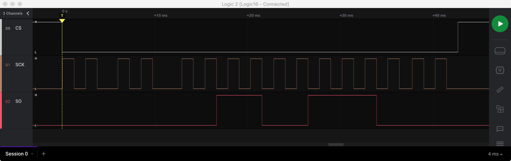
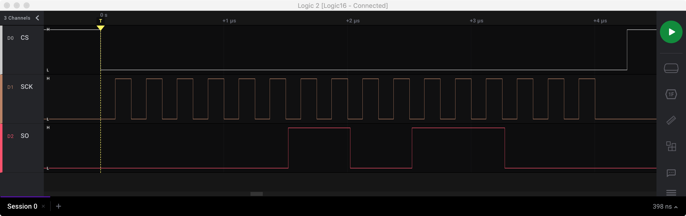

# Read temperature from MAX6675, a Cold-Junction-Compensated K-Thermocouple-to-Digital Converter

This folder contains some examples to show how to read temperature from MAX6675 converter. The examples have been prepared when developing [Toit package with MAX6675 driver](https://github.com/krzychb/toit-max6675).


- [max6675--bit-bang.toit](max6675-bit-bang.toit) - An example of reading MAX6675 converter using bit-banging of ESP32 GPIO pins.
- [max6675-spi.toit](max6675-spi.toit) - An example reading the MAX6675 converter usig the native SPI interface of ESP32.
- [max667.toit5](max6675.toit) - A simple example to read MAX6675 converter using a driver implemented in a separate package.


## Hardware connections

The application uses the following connection between ESP32 and MAX6675 converter.

| Signal Name         | ESP32 Pin | MAX6675 Pin |
| ------------------- | --------- | ------------|
| Chip select (CS)    |        12 |          CS |
| Serial output (SO)  |        13 |          SO |
| Serial clock (SCK)  |        14 |         SCK |
| Ground              |       GND |         GND |
| Power Supply 3.3 V  |           |         VCC |


## Running the application using Jaguar

Open a terminal and flash the Jaguar image to ESP32 board. Provide SSID and PASSWORD to your Wi-Fi network. If you have more than one ESP32 board connected to your computer, you will be asked to select the port name of the specific ESP32 board to flash the image.

```
jag config wifi set --wifi-ssid SSID --wifi-password PASSWORD
```

Upload `max6675-spi.toit` application to the ESP32 board. Note the upload will be done using the Wi-Fi network specified in the previous step.

```
jag watch max6675-spi.toit
```

By using `watch` we instruct Jaguar to "watch" the application source file for any changes. If a change is detected Jaguar will compile and upload the update to the ESP32.

Open another terminal and run the following command to monitor the application output.

```
jag monitor
```

You should see a similar output in the terminal:

```
Starting serial monitor of port 'COM3' ...
ets Jun  8 2016 00:22:57

rst:0x1 (POWERON_RESET),boot:0x13 (SPI_FAST_FLASH_BOOT)
ets Jun  8 2016 00:22:57

rst:0x10 (RTCWDT_RTC_RESET),boot:0x13 (SPI_FAST_FLASH_BOOT)
configsip: 188777542, SPIWP:0xee
clk_drv:0x00,q_drv:0x00,d_drv:0x00,cs0_drv:0x00,hd_drv:0x00,wp_drv:0x00
mode:DIO, clock div:2
load:0x3fff0030,len:188
ho 0 tail 12 room 4
load:0x40078000,len:12180
load:0x40080400,len:2936
entry 0x400805c8
clearing RTC memory: RTC memory is in inconsistent state
[flash reg] address 0x3f430000, size 0x00200000
[jaguar] INFO: program 1 re-starting from flash @ [0,28672]
Temperature: 33.0°C
[wifi] DEBUG: connecting
Temperature: 32.2°C
Temperature: 32.8°C
Temperature: 32.5°C
Temperature: 32.8°C
[wifi] DEBUG: connected
Temperature: 32.5°C
[wifi] INFO: got ip ip=192.168.1.17
[jaguar] INFO: running Jaguar device 'max6675' (id: 'fd35b832-e0b5-44fb-85e5-0fa22199f56c') on 'http://192.168.1.17:9000'
Temperature: 32.2°C
Temperature: 32.2°C
Temperature: 32.8°C
...
```

If the SPI interface of ESP32 is occupied by another device you can upload `max6675-bit-bang.toit` instead.

To use the example that implements a driver in an external package, first install the package.

```
jag pkg install github.com/krzychb/toit-max6675
```

Then load the example as described in previous steps.


## Timing diagrams reading the MAX6675

Reading MAX6675 Using bit-banging of GPIO pins of ESP32



Reading MAX6675 using the SPI interface of ESP32




## Related documents

- [MAX6675 Datasheet](https://datasheets.maximintegrated.com/en/ds/MAX6675.pdf) - MAX6675 Cold-Junction-Compensated K-Thermocouple-to-Digital Converter
- [MAX6675 Calculator](_more/max6675-temp-calc.xlsx) - MS Excel spreadsheet to calculate the temperature based on bit pattern read from MAX6675 converter