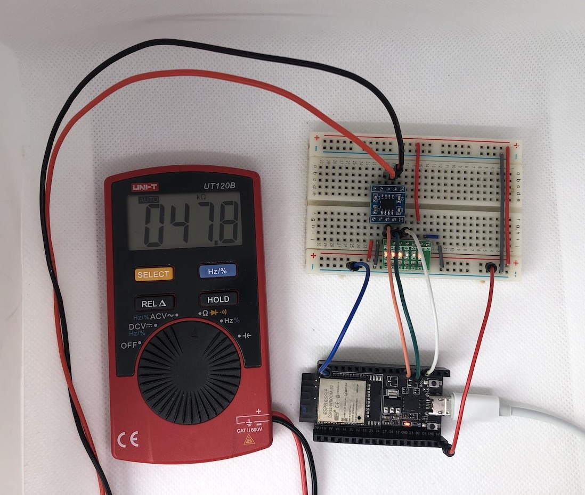
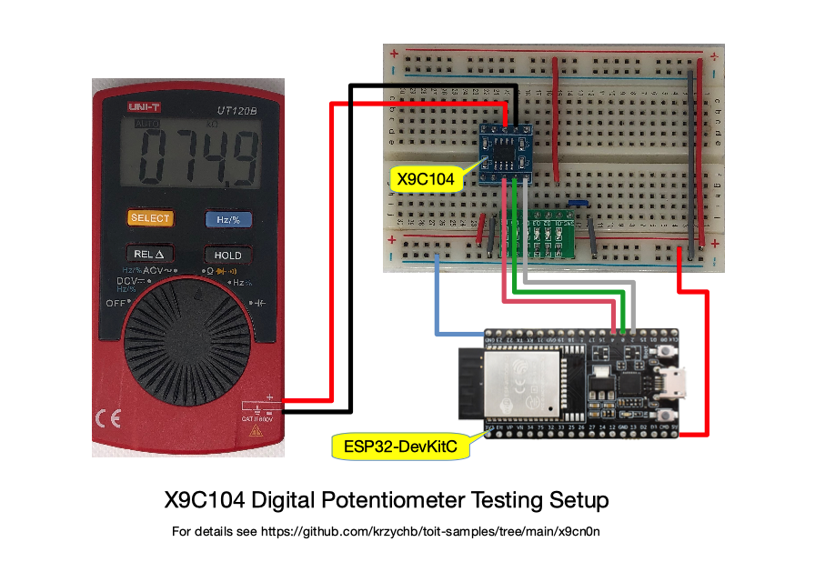
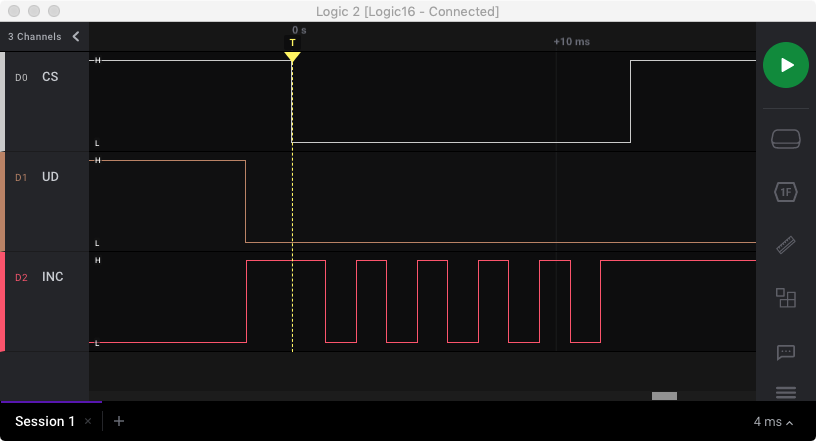
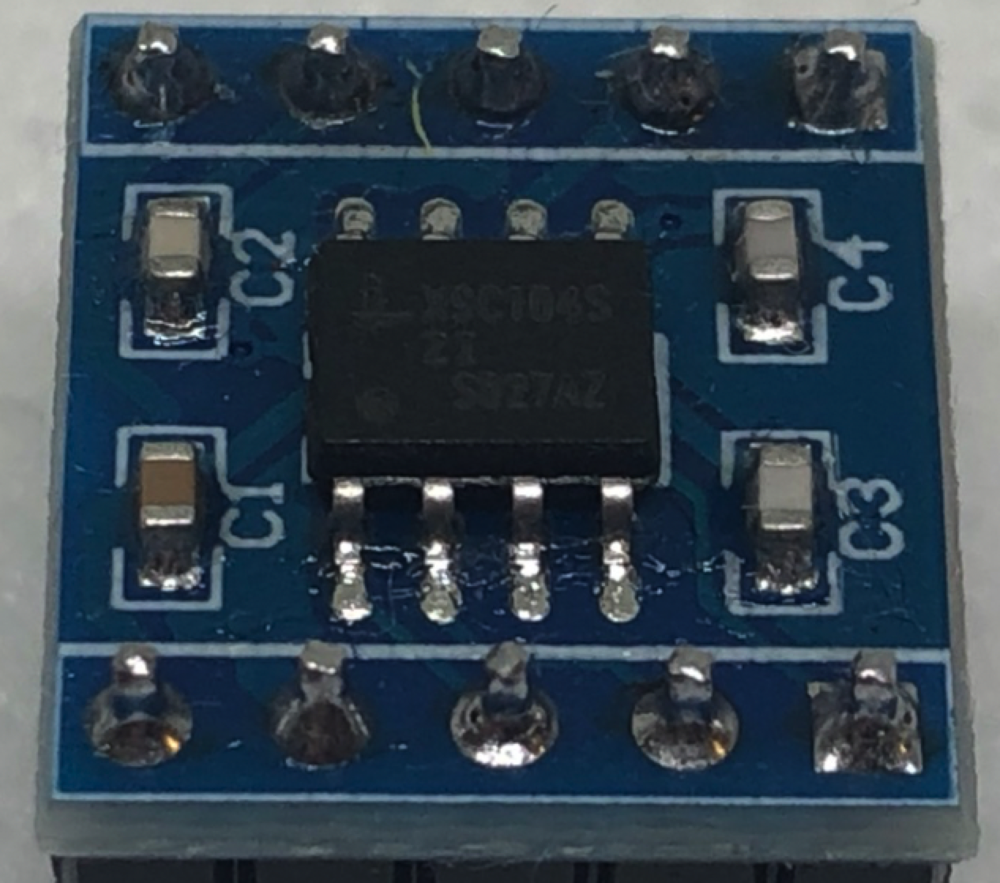
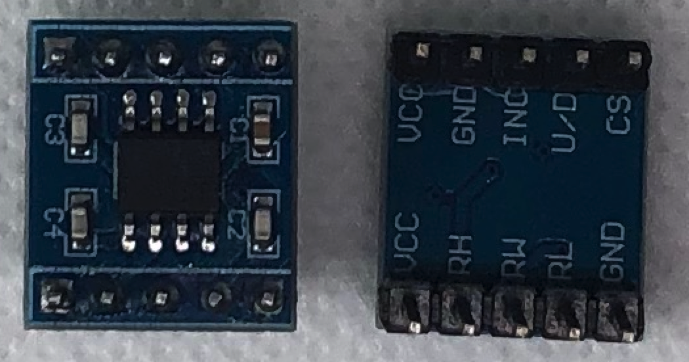

# Drive digitally controlled potentiometer X9Cn0n

This folder contains some examples to show how to control X9C104 and similar digipots, and provides the Toit class to control it.

- [x9cn0n-simple](x9cn0n-simple.toit) - A simple example to provide the basis of operating X9Cn0n digipots.
- [x9cn0n-class](x9cn0n-class.toit) - The Toit class to operate the digipot.

## The Story

Digital potentiometers are around for years and there are hundreds of examples of how to control them. I was looking for a way to provide variable pull down and pull up resistors to test my other [gpio-pull-up-down](../gpio-pull-up-down) example but I could not find any Toit library to control a digipot. I have purchased a pair of quite popular X9C104 digipots that is available from several manufacturers and multiple vendors. This model has several libraries available and multiple articles describe how to use it. Out of these resources, my attention was attracted by a very nice and simple Arduino library together with a quite comprehensive article [Interfacing X9C104 100K Digital Potentiometer Module with Arduino](https://electropeak.com/learn/interfacing-x9c104-100k-ohm-digital-potentiometer-module-with-arduino/) written by Mehran Maleki. Based on that I decided to write a driver and a control example in Toit. This also turned out to be a very good opportunity to learn the basics of writing classes in Toit.

## Required Hardware

- ESP32 board with at least three exposed and unused GPIO pins
- X9C104 or any other [X9Cn0n](_more/REN_x9c102-103-104-503_DST_20050310.pdf) digipot on a breakout board
- Breadboard and some wires to make connections
- Ohm meter
- Optionally some LEDs to visualize the status of the digipot's pins

Note: I saw these digipots in the DIP package. If you get one then no breakboard is needed.

## Hardware Connections

The example code is configured for the following connections:

| ESP32 GPIO  | X9C104 Pin | Description of X9C104 Pin Functionality      |
|-------------|------------|----------------------------------------------|
| GPIO2       | CS         | Chip select                                  |
| GPIO0       | UD         | Direction of counting: up and down           |
| GPIO4       | INC        | Pulse input to increment the wiper position  |

See the picture below of how the connections look with real hardware.

## Example Timing of Signals

Check [X9Cn0n datasheet](_more/REN_x9c102-103-104-503_DST_20050310.pdf) for specific timing requirements of the digipot's control signals. Below is an example of driving the digipot to change the wiper position by five steps down.

The specific signal sequence is as follows:

- *UD* signal is asserted low to move the wiper down.
- *INC* signal is initially asserted high. I have discovered that the digipot will miss one initial step if *INC* is low before the CS change below. The datasheet clearly shows that *INC* should be high before selecting the chip.
- Chip select *CS* is asserted low to make the chip respond to *UD* and *INC* control signals.
- Five *INC* pulses are generated. Note that the wiper position is changed on the falling edge of the *INC* signal.
- Finally, the chip select *CS* is asserted high to deselect the chip.
- At that point, the current wiper position is saved in the non-volatile memory of the chip and the position will be restored on the chip power-up.

**Notes:**

1. The non-volatile memory of the chip has a limited number of write cycles (see parameter *Medium Endurance* that is equal to *100,000 data changes per bit per register* in the attached [X9Cn0n datasheet](_more/REN_x9c102-103-104-503_DST_20050310.pdf)). To avoid saving the current wiper position and wearing out the memory you need to keep the *INC* signal low before deselecting the chip.

2. The duration of signals may be shorter than in the example code. For example, the minimum duration of *INC* is 1 µs while in the code it is 1 ms. The reason for making the signals longer is the use of the standard `sleep --ms=1` function that has a minimum resolution of 1 ms. If you like to operate the digipot faster then go ahead and update the code.

## Is my X9C104 not genuine or did I miss something?

For some reason, my digpot has only 30 wiper tap points while according to the datasheet it should have 100 tap points. I have purchased two digpots and both behave the same. Please see the picture below, maybe you have noticed the same issue and recognize this model. It is also possible that I refer to an incorrect datasheet or miss something in the control procedure.

 

## How to Use Toit

Check the readme file in the [root folder](../README.md) for information on how to configure and use Toit.

## Conclusion

I had a lot of fun testing the digipot and programming the driver for it in Toit. This task turned out to be quite easy and I believe the code is quite compact compared to other existing libraries. Using Toit and Jaguar I was able to load the updated code within seconds, nothing to compare to developing with other tools where you have to load the whole binary each time you make any code modification.
